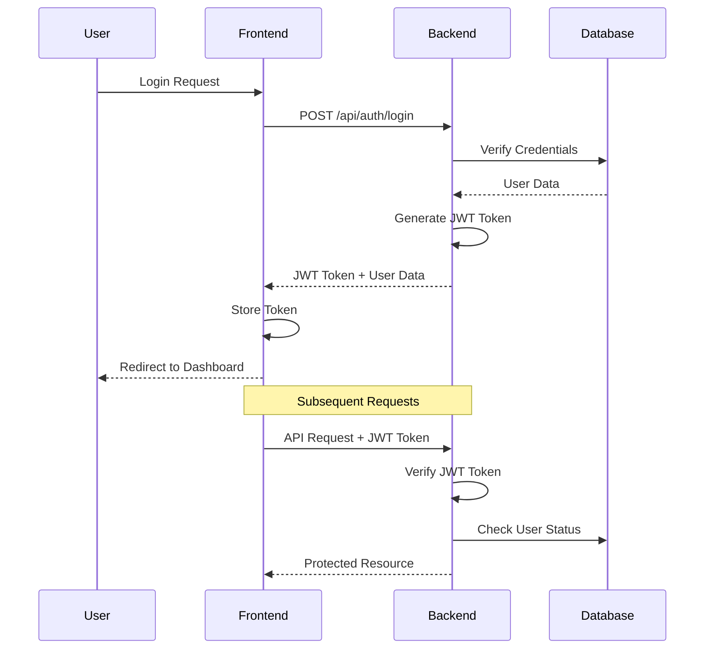
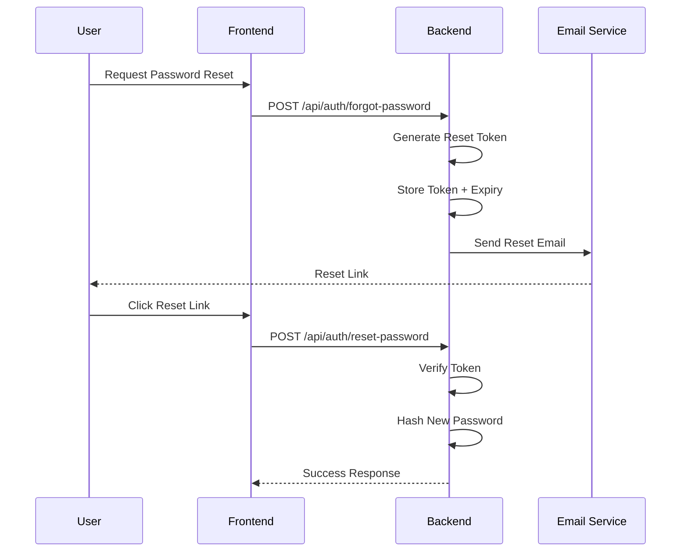

# Security Architecture Documentation

## Overview

The Healthcare Web Application implements a comprehensive security architecture designed to protect sensitive medical data, ensure user privacy, and maintain system integrity. The security framework follows industry best practices and healthcare compliance standards.

## Security Principles

### 1. Defense in Depth
Multiple layers of security controls to protect against various attack vectors:
- **Network Security**: Firewalls, VPN, secure protocols
- **Application Security**: Input validation, authentication, authorization
- **Data Security**: Encryption, access controls, audit logging
- **Infrastructure Security**: Secure hosting, regular updates, monitoring

### 2. Zero Trust Architecture
- **Never Trust, Always Verify**: All requests are authenticated and authorized
- **Least Privilege Access**: Users only access what they need
- **Continuous Monitoring**: Real-time security monitoring and alerting

### 3. Privacy by Design
- **Data Minimization**: Collect only necessary data
- **Purpose Limitation**: Use data only for intended purposes
- **Transparency**: Clear privacy policies and user consent

## Authentication & Authorization

### Authentication Flow



### JWT Token Implementation

#### Token Structure
```json
{
  "header": {
    "alg": "HS256",
    "typ": "JWT"
  },
  "payload": {
    "userId": 123,
    "role": "patient",
    "iat": 1640995200,
    "exp": 1643587200
  },
  "signature": "HMACSHA256(base64UrlEncode(header) + '.' + base64UrlEncode(payload), secret)"
}
```

#### Token Configuration
- **Algorithm**: HMAC SHA256
- **Expiration**: 7 days (configurable)
- **Secret**: Environment variable (JWT_SECRET)
- **Issuer**: Healthcare Web App

#### Token Security Features
- **Secure Storage**: HTTP-only cookies or secure localStorage
- **Automatic Refresh**: Token refresh mechanism
- **Blacklisting**: Invalidated tokens on logout
- **Rotation**: Regular secret rotation

### Password Security

#### Password Hashing
```javascript
// bcrypt implementation
const saltRounds = 12;
const hashedPassword = await bcrypt.hash(password, saltRounds);
```

#### Password Requirements
- **Minimum Length**: 6 characters
- **Complexity**: Recommended strong passwords
- **Storage**: Never stored in plain text
- **Validation**: Server-side validation

#### Password Reset Flow


### Role-Based Access Control (RBAC)

#### User Roles
1. **Patient**
   - Access to own medical records
   - Book appointments
   - View lab results
   - Manage profile

2. **Doctor**
   - Access to assigned patients
   - Manage appointments
   - Create prescriptions
   - Update medical records

3. **Admin**
   - System administration
   - User management
   - Lab test management
   - System analytics

#### Authorization Middleware
```javascript
const authorizeRoles = (...roles) => {
  return (req, res, next) => {
    if (!req.user) {
      return res.status(401).json({ message: 'Authentication required' });
    }
    
    if (!roles.includes(req.user.role)) {
      return res.status(403).json({ message: 'Insufficient permissions' });
    }
    
    next();
  };
};
```

#### Resource Access Control
```javascript
const authorizeResourceAccess = (resourceType) => {
  return async (req, res, next) => {
    if (req.user.role === 'admin') {
      return next();
    }
    
    // Check if user owns the resource
    const resource = await getResource(req.params.id);
    if (resource.userId === req.user.id) {
      return next();
    }
    
    return res.status(403).json({ message: 'Access denied' });
  };
};
```

## Data Protection

### Encryption at Rest

#### Database Encryption
- **MySQL Encryption**: InnoDB tablespace encryption
- **Sensitive Fields**: Additional field-level encryption
- **Key Management**: Secure key storage and rotation

#### File Storage Encryption
- **Uploaded Files**: Encrypted storage
- **Medical Images**: DICOM encryption
- **Backup Encryption**: Encrypted backups

### Encryption in Transit

#### HTTPS/TLS
- **Protocol**: TLS 1.3
- **Certificate**: Valid SSL certificate
- **Cipher Suites**: Strong encryption algorithms
- **HSTS**: HTTP Strict Transport Security

#### API Security
- **JWT Tokens**: Secure token transmission
- **Request Signing**: HMAC request signing
- **Rate Limiting**: API abuse prevention

### Data Anonymization

#### Personal Data Protection
- **PII Masking**: Mask sensitive personal information
- **Data Pseudonymization**: Replace identifiers with pseudonyms
- **Audit Trails**: Track data access and modifications

#### Medical Data Handling
- **HIPAA Compliance**: Healthcare data protection standards
- **Data Retention**: Automatic data purging policies
- **Consent Management**: User consent tracking

## Input Validation & Sanitization

### Server-Side Validation

#### Express Validator Implementation
```javascript
const registerValidation = [
  body('email').isEmail().normalizeEmail(),
  body('password').isLength({ min: 6 }),
  body('firstName').notEmpty().trim(),
  body('phone').optional().isMobilePhone()
];
```

#### Validation Rules
- **Email**: RFC 5322 compliant email validation
- **Phone**: International phone number formats
- **Date**: ISO 8601 date validation
- **File Upload**: Type and size validation

### SQL Injection Prevention

#### Sequelize ORM Protection
```javascript
// Parameterized queries prevent SQL injection
const user = await User.findOne({
  where: { email: userEmail }
});
```

#### Database Security
- **Prepared Statements**: All queries use prepared statements
- **Input Sanitization**: All inputs are sanitized
- **Query Validation**: Query structure validation

### XSS Protection

#### Input Sanitization
```javascript
// Sanitize HTML content
const sanitizeHtml = require('sanitize-html');
const cleanHtml = sanitizeHtml(userInput, {
  allowedTags: [],
  allowedAttributes: {}
});
```

#### Output Encoding
- **HTML Encoding**: Encode special characters
- **Context-Aware**: Different encoding for different contexts
- **Content Security Policy**: Restrict script execution

## File Upload Security

### File Validation
```javascript
const fileFilter = (req, file, cb) => {
  const allowedTypes = /pdf|jpg|jpeg|png|gif/;
  const extname = allowedTypes.test(path.extname(file.originalname).toLowerCase());
  const mimetype = file.mimetype;
  
  if (mimetype && extname) {
    return cb(null, true);
  } else {
    cb(new Error('Only image and PDF files are allowed'));
  }
};
```

### Upload Security Features
- **File Type Validation**: Whitelist allowed file types
- **Size Limits**: Maximum file size restrictions
- **Virus Scanning**: Malware detection
- **Secure Storage**: Isolated file storage
- **Access Control**: Restricted file access

## Session Management

### Session Security
- **Secure Cookies**: HTTP-only, secure, same-site cookies
- **Session Timeout**: Automatic session expiration
- **Concurrent Sessions**: Limit concurrent sessions
- **Session Invalidation**: Immediate logout on security events

### Session Storage
- **Server-Side**: Redis-based session storage
- **Encryption**: Encrypted session data
- **Rotation**: Regular session ID rotation

## API Security

### Rate Limiting
```javascript
const limiter = rateLimit({
  windowMs: 15 * 60 * 1000, // 15 minutes
  max: 100, // limit each IP to 100 requests per windowMs
  message: 'Too many requests from this IP'
});
```

### API Security Headers
```javascript
app.use(helmet({
  crossOriginResourcePolicy: { policy: "cross-origin" },
  contentSecurityPolicy: {
    directives: {
      defaultSrc: ["'self'"],
      styleSrc: ["'self'", "'unsafe-inline'"],
      scriptSrc: ["'self'"],
      imgSrc: ["'self'", "data:", "https:"]
    }
  }
}));
```

### CORS Configuration
```javascript
app.use(cors({
  origin: process.env.CLIENT_URL,
  credentials: true,
  methods: ['GET', 'POST', 'PUT', 'DELETE'],
  allowedHeaders: ['Content-Type', 'Authorization']
}));
```

## Monitoring & Logging

### Security Logging
```javascript
// Security event logging
const logSecurityEvent = (event, userId, ip, details) => {
  console.log({
    timestamp: new Date().toISOString(),
    event,
    userId,
    ip,
    details,
    severity: 'HIGH'
  });
};
```

### Audit Trail
- **User Actions**: Login, logout, data access
- **Data Changes**: Create, update, delete operations
- **Security Events**: Failed logins, permission violations
- **System Events**: Configuration changes, errors

### Monitoring Alerts
- **Failed Login Attempts**: Multiple failed login alerts
- **Suspicious Activity**: Unusual access patterns
- **Data Breaches**: Potential data exposure events
- **System Intrusions**: Unauthorized access attempts

## Error Handling & Information Disclosure

### Secure Error Handling
```javascript
const errorHandler = (err, req, res, next) => {
  // Log error for monitoring
  console.error(err);
  
  // Don't expose sensitive information
  const message = process.env.NODE_ENV === 'production' 
    ? 'Internal server error' 
    : err.message;
    
  res.status(err.statusCode || 500).json({
    success: false,
    message
  });
};
```

### Information Disclosure Prevention
- **Generic Error Messages**: No sensitive information in errors
- **Stack Trace Protection**: Hide stack traces in production
- **Database Error Masking**: Mask database-specific errors
- **Debug Information**: Disable debug mode in production

## Compliance & Standards

### Healthcare Compliance
- **HIPAA**: Health Insurance Portability and Accountability Act
- **GDPR**: General Data Protection Regulation
- **HITECH**: Health Information Technology for Economic and Clinical Health
- **Local Regulations**: Country-specific healthcare regulations

### Security Standards
- **OWASP Top 10**: Web application security risks
- **ISO 27001**: Information security management
- **SOC 2**: Service organization control
- **NIST Cybersecurity Framework**: Security guidelines

### Data Retention Policies
- **Medical Records**: 7 years (configurable)
- **Audit Logs**: 3 years
- **User Data**: Until account deletion
- **Backup Data**: 30 days

## Security Testing

### Automated Security Testing
- **Static Analysis**: Code security scanning
- **Dependency Scanning**: Vulnerable dependency detection
- **Container Scanning**: Docker image security
- **Infrastructure Scanning**: Cloud security assessment

### Manual Security Testing
- **Penetration Testing**: Regular security assessments
- **Code Reviews**: Security-focused code reviews
- **Vulnerability Assessment**: Regular vulnerability scans
- **Red Team Exercises**: Simulated attack scenarios

### Security Metrics
- **Mean Time to Detection (MTTD)**: Time to detect security incidents
- **Mean Time to Response (MTTR)**: Time to respond to incidents
- **Vulnerability Metrics**: Open vulnerabilities tracking
- **Compliance Metrics**: Compliance score tracking

## Incident Response

### Security Incident Response Plan
1. **Detection**: Automated monitoring and alerting
2. **Assessment**: Impact and severity evaluation
3. **Containment**: Immediate threat isolation
4. **Eradication**: Remove threat and vulnerabilities
5. **Recovery**: Restore normal operations
6. **Lessons Learned**: Post-incident analysis

### Incident Classification
- **Critical**: Data breach, system compromise
- **High**: Unauthorized access, privilege escalation
- **Medium**: Failed attacks, suspicious activity
- **Low**: Policy violations, minor issues

### Communication Plan
- **Internal**: Security team, management, stakeholders
- **External**: Users, authorities, partners
- **Timeline**: Immediate, 24 hours, 72 hours
- **Channels**: Secure communication channels

## Security Best Practices

### Development Security
- **Secure Coding**: Follow secure coding practices
- **Code Reviews**: Security-focused code reviews
- **Testing**: Security testing in CI/CD pipeline
- **Documentation**: Security documentation maintenance

### Operational Security
- **Access Control**: Principle of least privilege
- **Monitoring**: Continuous security monitoring
- **Updates**: Regular security updates
- **Training**: Security awareness training

### User Security
- **Authentication**: Strong authentication requirements
- **Education**: User security education
- **Reporting**: Security incident reporting
- **Privacy**: Privacy protection measures

This security architecture provides comprehensive protection for the Healthcare Web Application, ensuring the confidentiality, integrity, and availability of sensitive medical data while maintaining compliance with healthcare regulations and industry standards.
